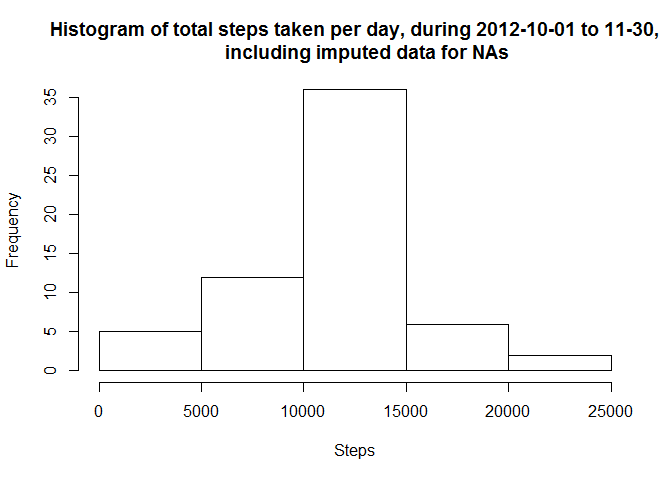

# Reproducible Research: Peer Assessment 1


### Loading and preprocessing the data

```r
setwd("C:/Users/kinoe/Documents/Coursera/Reproducible Research")
data <- read.csv("activity.csv")
```


### What is the mean total number of steps taken per day?


```r
x <- tapply(data$steps, data$date, sum)

hist(x, main="Histogram of total steps taken per day, during 2012-10-01 to 11-30", xlab="Steps")
```

 


#### Median and Mean of total steps taken per day, during 2012-10-01 to 2012-11-30


```r
y <- summary(x)
y[3:4]
```

```
## Median   Mean 
##  10760  10770
```


### What is the average daily activity pattern?


```r
u <- tapply(data$steps, data$interval, mean, na.rm=TRUE)
plot(u ~ names(u), type="l", xlab="Time of day", ylab="Average steps per 5 min interval",
    main="Steps per 5 min interval, averaged across 2012-10-01 to 11-30")
```

 

- Which 5-minute interval, on average across all the days in the dataset, contains the maximum number of steps?


```r
names(subset(u, u==max(u)))
```

```
## [1] "835"
```


### Imputing missing values

Total number of missing values in the dataset

```r
sum(is.na(data))
```

```
## [1] 2304
```


Impute missing values by using mean for that interval

```r
## using average steps/interval calculated earlier 
u <- as.vector(u)
t <- as.numeric(levels(factor(data$interval)))
w <- data.frame(cbind(t, u))
names(w) <- c("int", "ave")

data$steps2 <- data$steps

## Fill new variable steps2 with imputations
for(i in 1:17568) {
    if(is.na(data[i,1])) {
        a <- data[i,3]
        logic <- w$int==a
        b <- which(logic==TRUE)
        data[i,4] <- w[b,2]     
    }
    else {
        data[i,4] <- data[i,1]
    }
} 
```


#### Repeat earlier steps with imputed data


```r
x <- tapply(data$steps2, data$date, sum)

hist(x, main="Histogram of total steps taken per day, during 2012-10-01 to 11-30,
     including imputed data for NAs", xlab="Steps")
```

 


```r
y <- summary(x)
y[3:4]
```

```
## Median   Mean 
##  10770  10770
```

The results of this analysis show that imputing missing data brings the median and mean closer together and changes the distribution of the data points to concentrate more in the middle. This falsely underrepresents the uncertainty of the data.


### Are there differences in activity patterns between weekdays and weekends?

- Create weekday/weekend indicator variable

```r
c <- as.POSIXct(data$date)
d <- data.frame(c)
d$day <- weekdays(d$c)

for(i in 1:17568) {
    if(d$day[i]=="Saturday"||d$day[i]=="Sunday"){
        d$end[i] <- "Weekend"
    }
    else {
        d$end[i] <- "Weekday"
    }
} 
```

- Time series plot of 5-minute interval by Weekday vs. Weekend


```r
new <- cbind(d[c(-1)], data[c(-1)])

new1 <- subset(new, (new$end=="Weekday")==TRUE)
new2 <- subset(new, (new$end=="Weekday")==FALSE)

e1 <- tapply(new1$steps, new1$interval, mean) ## weekday
e2 <- tapply(new2$steps, new2$interval, mean) ## weekend

f1 <- data.frame(cbind(as.numeric(names(e1)), as.numeric(e1)))
f1$end <- "Weekday"
names(f1) <- c("interval", "steps", "end")
f2 <- data.frame(cbind(as.numeric(names(e2)), as.numeric(e2)))
f2$end <- "Weekend"
names(f2) <- c("interval", "steps", "end")

both <- data.frame(rbind(f1, f2))


library(ggplot2)
```

```
## Warning: package 'ggplot2' was built under R version 3.2.1
```

```r
both$end <- as.factor(both$end)
g <- ggplot(both, aes(x=interval, y=steps))
g + geom_line() + facet_wrap( ~ end, ncol=1) + labs(x="Time", y=" 5 min interval") + ggtitle("Steps averaged across 2012-10-01 to 11-30, by Weekday vs. Weekend")
```

 

